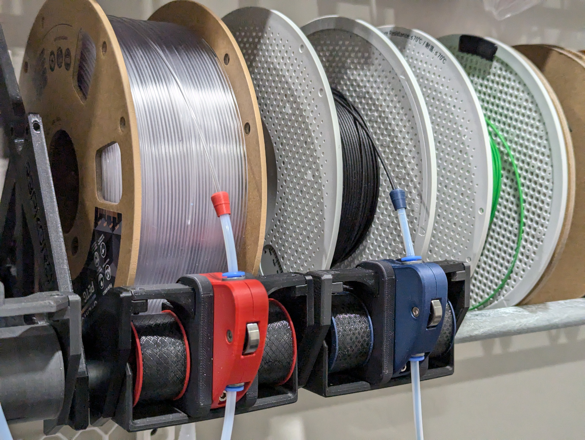

# Reprack Re-spooler

This re-spooler works on the general principal that the 
[Filamentalist](https://github.com/Enraged-Rabbit-Community/ERCF_v2/tree/master/Recommended_Options/Filamentalist_Rewinder)
project uses but is adapted to work with the ["Auto-Rewind Spool Holder for RepRack"](https://www.printables.com/model/292276-auto-rewind-spool-holder-for-reprack) and some inspiration take from the re-spooler in the [8-track project](https://github.com/ArmoredTurtle/8-Track-Raven-Alpha/tree/main).

## Goals / Challenges to overcome

There are some challenges with using Filamentalist on the Reprack that required something a little different.

### Roller wheel size

Due to the position of the conduit pipe that is core to the Reprack, using the larger wheels that Filamentalist uses
is not really feasible. However, these larger wheels are important to the rewinding ratio to ensure that even on near
empty spools, it rewinds fast enough for a tight wind. So we need smaller and faster rollers.

To combat this, the drive wheel (the wheel with the o-rings, driven by filament being pushed) is not directly attached to the
roller shaft, but is instead positioned next to the roller shaft. This allows us to apply a gear ratio of roughly 1:2, making the
roller shaft spin about twice the speed of the drive wheel.

### Direction of feed

The standard filamentalist feeds filament from the bottom of the spool and out the front. This is rather inconvenient to load a
spool when there are other shelves above it. When used in a wall mounted Reprack, feeding from the front of the spool, going downward
is more convenient.

The solution for the roller wheel size also makes way for the direction of feed as well. Effectively we need the roller shaft to spin
in the opposite direction of the drive wheel. By having the drive wheel mesh with roller shaft rather than having an axial connection,
the directions are reversed.

## Documentation

See [Documentation](./Documentation/README.md).

## Issues

While developing this, I was using o-rings from an old assortment kit from harbor freight. However, in prepraration for release, I ordered a set of #211 o-rings and they seem to have a larger cross section than my harbor freight ones (which are likely smaller than spec size)...more than the little amount of tensioning in the sliding drive wheel can accommodate. As a result, the tension with these new o-rings is quite a bit higher than my other ones. So there may need to be some tweaks to the tension arm to work with these o-rings.